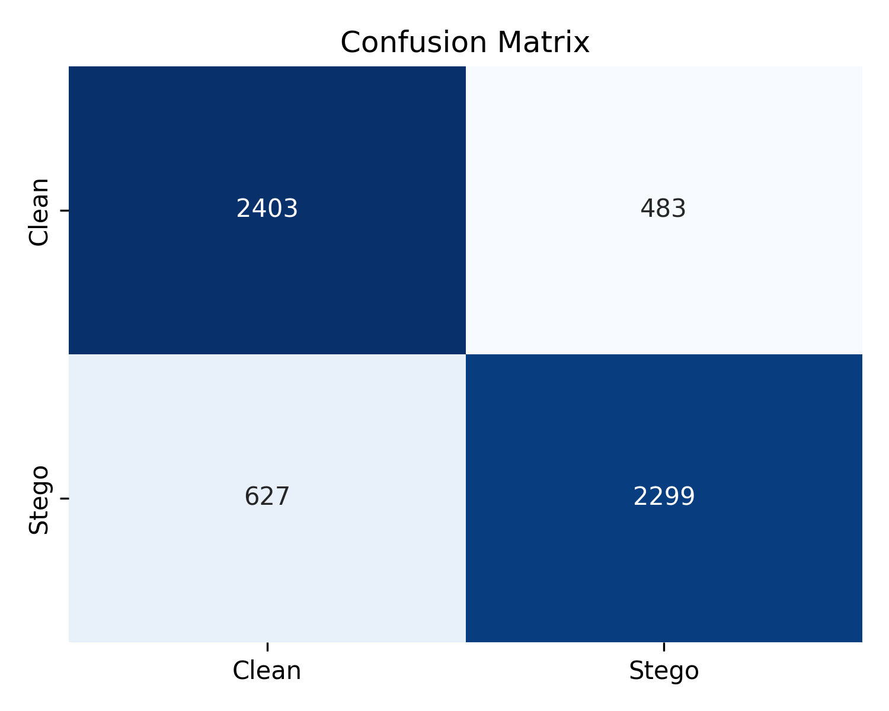
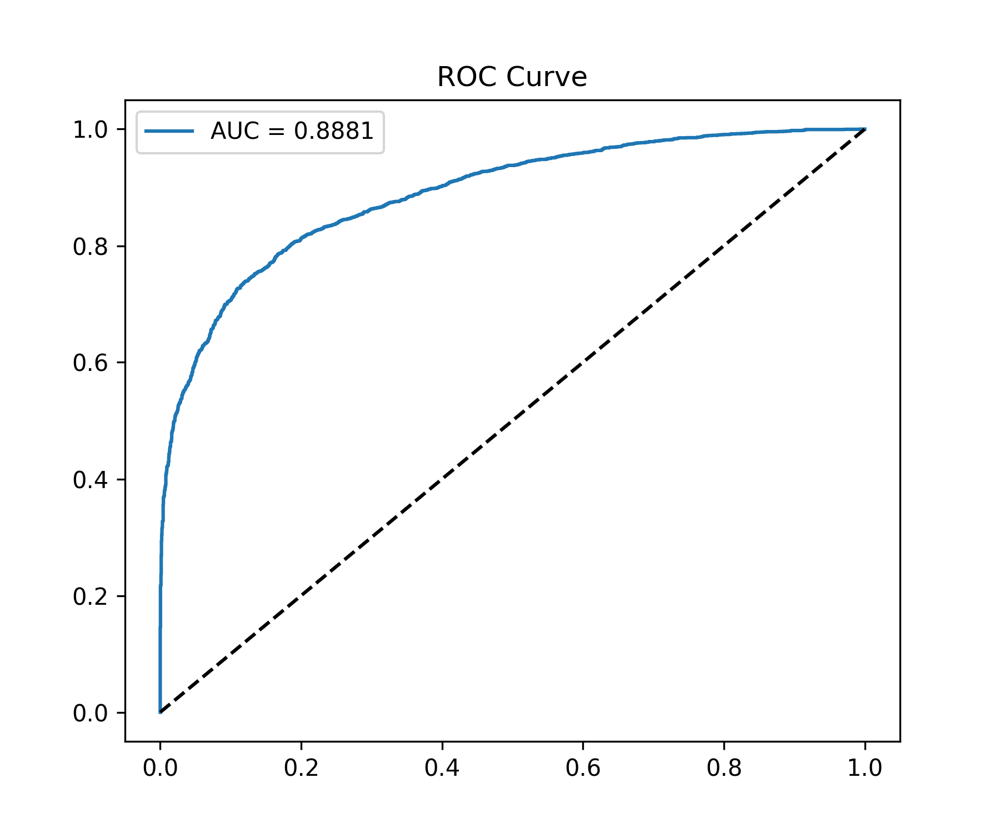

# 🛡️ StegoAI – Advanced PDF Steganalysis Platform

### *AI-Powered Detection of Covert Data in Documents*

---

## 📌 Overview

**StegoAI** is a full-stack, production-grade **machine learning platform** designed to detect hidden (steganographic) data embedded within PDF files.

Unlike traditional security tools, StegoAI performs **deep structural and statistical analysis** to uncover covert communication channels that remain invisible to standard detection systems.

The platform integrates:

* 🧠 **Machine Learning Engine** (XGBoost, LightGBM, RandomForest)
* 🚀 **FastAPI Backend** (real-time inference API)
* 🎨 **Streamlit Cyber UI** (interactive detection dashboard)

---

## 🚨 Problem Statement

Modern cyber threats increasingly use **steganography** to conceal data inside documents such as PDFs.

This enables attackers to:

* Exfiltrate sensitive information
* Deliver hidden malware payloads
* Maintain covert communication channels

🔴 Traditional security systems fail because they:

* Rely on signature-based detection
* Ignore document structure anomalies
* Cannot detect hidden semantic patterns

---

## 💡 Solution

StegoAI introduces a **forensic AI pipeline** that:

* Extracts **multi-dimensional features** from PDFs
* Detects anomalies in:

  * Metadata entropy
  * Invisible / encoded text
  * Structural inconsistencies
  * Binary padding patterns
* Classifies files into:

  * ✅ Clean (Safe)
  * ⚠️ Stego (Hidden Data Detected)

---

## ⚙️ Key Capabilities

* 🧠 **Ensemble Learning Models**

  * Random Forest (baseline)
  * XGBoost (production model)
  * LightGBM (optimized alternative)

* 🔍 **Advanced Feature Engineering**

  * Entropy-based detection
  * XREF and object structure analysis
  * Hidden text and Unicode anomaly detection

* 📊 **Robust Evaluation Framework**

  * Cross-validation
  * Confusion matrix & ROC analysis

* 🚀 **Real-Time API**

  * Upload PDFs
  * Get instant threat classification

* 🎨 **Cybersecurity Dashboard (UI)**

  * Interactive threat visualization
  * Risk-level indicators

---

## 🧠 System Architecture

```text id="arch2"
PDF Input
   ↓
Feature Engineering (Forensic Analysis)
   ↓
ML Model (XGBoost / RF / LGBM)
   ↓
FastAPI Backend
   ↓
Streamlit UI Dashboard
```

---

## 📊 Model Performance

Evaluation performed using **Stratified 5-Fold Cross-Validation**

| Model         | Accuracy   | Precision  | Recall     | F1 Score   | CV Mean F1 |
| ------------- | ---------- | ---------- | ---------- | ---------- | ---------- |
| Random Forest | 0.7989     | 0.7995     | 0.7989     | 0.7988     | 0.7963     |
| XGBoost       | 0.8061     | 0.8067     | 0.8061     | 0.8060     | **0.8107** |
| LightGBM      | **0.8137** | **0.8147** | **0.8137** | **0.8135** | 0.8075     |

📌 **XGBoost selected for deployment** due to superior generalization and stability.

---

## 🧪 Visual Results

### 📊 Confusion Matrix



### 📈 ROC Curve



---

## 🚀 How to Run (Backend + UI)

### 1️⃣ Clone Repository

```bash id="clone2"
git clone https://github.com/amn2905/stegoai.git
cd stegoai
```

### 2️⃣ Install Dependencies

```bash id="install2"
pip install -r requirements.txt
```

### 3️⃣ Setup Environment

```env id="env2"
MODEL_PATH=models/best_model.pkl
PORT=8000
MAX_FILE_SIZE_MB=10
```

### 4️⃣ Download Model

👉 (external link required)

Place here:

```text id="path2"
models/best_model.pkl
```

---

## ▶️ Run Backend

```bash id="run1"
uvicorn api.main:app --reload
```

---

## 🎨 Run UI

```bash id="run2"
streamlit run ui/app.py
```

---

## 🌐 Access

* API Docs → http://127.0.0.1:8000/docs
* UI → http://localhost:8501

---

## 📡 API Capabilities

* `/upload-pdf` → Upload & analyze PDF
* `/predict` → Feature-based prediction
* `/model-info` → Model metadata

---

## 📦 Sample Output

```json id="out2"
{
"prediction":"Stego"
"confidence":0.6217
"risk_level":"High"
"decision":"Confident Stego"
"model_used":"XGBoost"
"probabilities":{
"clean":0.3783
"stego":0.6217
}
}
```

---

# 🌍 Real-World Applications

StegoAI has strong applicability across multiple high-impact domains:

### 🔐 Cybersecurity

* Detect hidden malware payloads in documents
* Prevent covert data exfiltration

### 🕵️ Digital Forensics

* Investigate cybercrime evidence
* Identify hidden communication channels

### 🏢 Enterprise Security

* Scan documents in secure pipelines
* Integrate with SIEM systems

### 🏦 Banking & Finance

* Detect fraud via hidden document manipulation
* Secure confidential document exchange

### 🛡️ Government & Defense

* Intelligence analysis
* Covert communication detection

### 📁 Cloud Storage Security

* Scan uploaded files for hidden threats

---

## 📈 Impact

* 🚀 Enables detection of **non-obvious cyber threats**
* 🔍 Provides **forensic-level document analysis**
* ⚡ Supports **real-time threat detection pipelines**
* 🧠 Bridges gap between **ML and cybersecurity**

---

## 📁 Project Structure

```text id="struct2"
api/        → Backend API
src/        → ML pipeline
ui/         → Streamlit frontend
models/     → trained models
results/    → evaluation outputs
docs/       → documentation
```

---

## 🛠️ Tech Stack

* Python
* Scikit-learn
* XGBoost / LightGBM
* FastAPI
* Streamlit
* Optuna

---

## 🔐 Security Perspective

StegoAI focuses on **behavioral + structural detection**, not just signatures, making it resilient against:

* Unknown attack patterns
* Obfuscated payloads
* Adaptive steganography techniques

---

## 📈 Future Scope

* Multi-modal steganalysis (image/audio/video)
* Deep learning-based detection
* Real-time streaming analysis
* SIEM integration

---

## 🤝 Collaboration

For research, funding, or deployment:

📩 **[hamidamaan3@gmail.com](mailto:hamidamaan3@gmail.com)**

---

## 📜 License

All Rights Reserved

---

## 🧠 Final Note

StegoAI is not just a model—it is a **cybersecurity-grade intelligent detection system** built to uncover hidden threats in modern digital environments.
